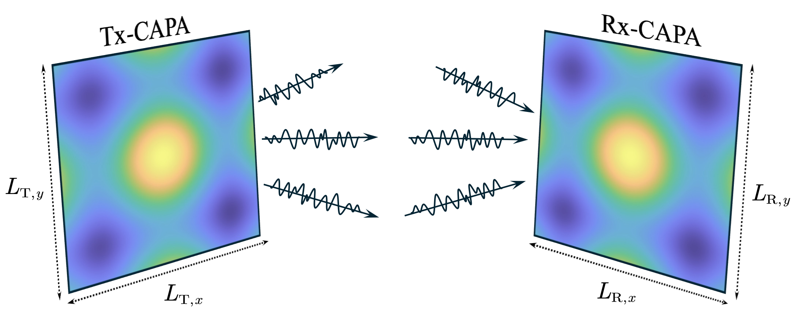

# Beamforming Optimization for Continuous Aperture
Array (CAPA)-based Communications

The code for the papers 

**Z. Wang, C. Ouyang, and Y. Liu, “Beamforming Design for Continuous Aperture Array (CAPA)-Based MIMO Systems,” *IEEE Trans. Wireless Commun.*, 2025.** [[IEEE](https://ieeexplore.ieee.org/document/10910020)] [[Arxiv](https://arxiv.org/abs/2504.00181)]



Abstract: An efficient beamforming design is proposed for continuous aperture array (CAPA)-based point-to-point multiple-input multiple-output (MIMO) systems. In contrast to conventional spatially discrete array (SPDA)-MIMO systems, whose optimal beamforming can be obtained using singular-value decomposition, CAPA-MIMO systems require solving the eigendecomposition of a Hermitian kernel operator, which is computationally prohibitive. To address this challenge, an explicit closed-form expression for the achievable rate of CAPA-MIMO systems is first derived as a function of the continuous transmit beamformer. Subsequently, an iterative weighted minimum mean-squared error (WMMSE) algorithm is proposed, directly addressing the CAPA-MIMO beamforming optimization without discretization approximation. Closed-form updates for each iteration of the WMMSE algorithm are derived via the calculus of variations (CoV) method. For low-complexity implementation, an equivalent matrix-based iterative solution is introduced using Gauss-Legendre quadrature. Our numerical results demonstrate that 1) CAPA-MIMO achieves substantial performance gain over the SPDA-MIMO, 2) the proposed WMMSE algorithm enhances performance while significantly reducing computational complexity compared to state-of-the-art Fourier-based approaches, and 3) the proposed WMMSE algorithm enables practical realization of parallel, non-interfering transmissions.


## Running the simulations

### Prerequisites

- [MATLAB](https://uk.mathworks.com/products/matlab.html)

### Launch

Run `main.m` for the main algorithms


## Citing
If you in any way use this code for research, please cite our original articles listed above. The corresponding BiBTeX citation is given below:
```
@article{wang2025capa-mimo,
  title={Beamforming Design for Continuous Aperture Array (CAPA)-Based MIMO Systems},
  author={Wang, Zhaolin and Ouyang, Chongjun and Liu, Yuanwei},
  journal={{IEEE} Trans. Wireless Commun.},
  year={2025}
}

```
